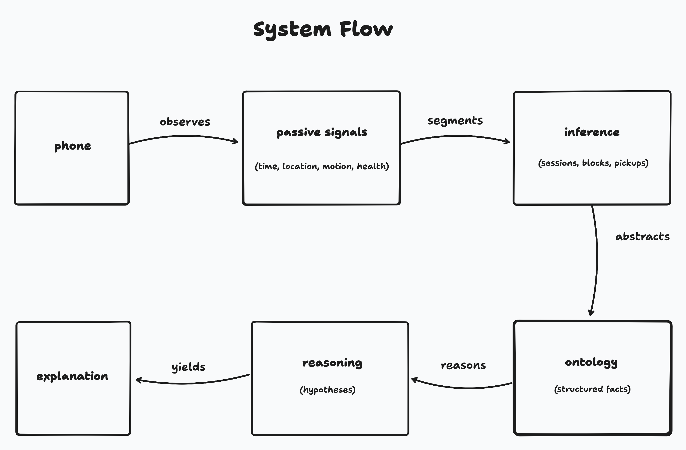
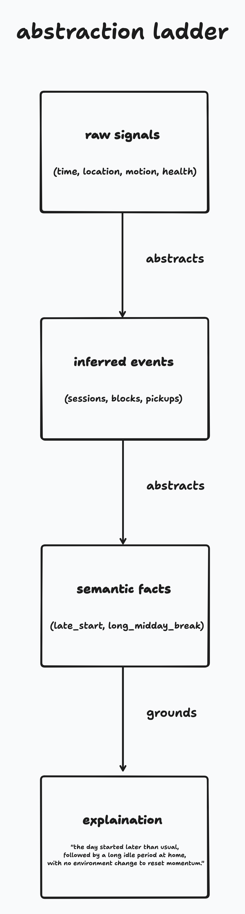
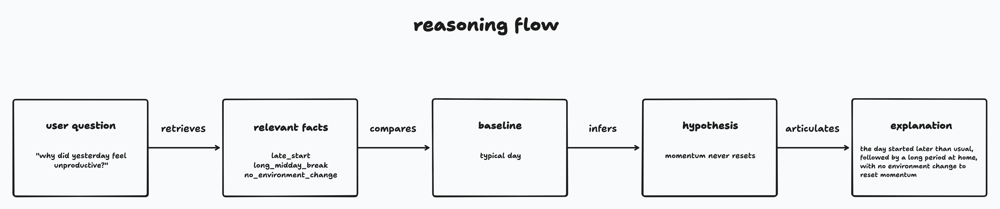

# daytrace 💭

tracing *why* days feel productive or unproductive using passive signals and ontology-based reasoning.

this is an **exploration project**, not a polished consumer app (yet , maybe later).

it’s an attempt to understand how raw personal data turns into actual insight.

---

## why this exists

i kept asking the same questions about my days and none of the apps helped.

not "how many hours did i work?" but:

* why did today feel heavy?
* why do some busy days still feel empty?
* why do my days usually fall apart after a certain point?

most tools stop at tracking.

daytrace exists to push one layer deeper , from *events* to *explanations*.

---

## the problem

most productivity apps feel fake.

* they rely on self-reported input
* they ask you how you feel every day
* they show charts that don’t explain anything

meanwhile, your phone already captures a ton of signal , location, time, routines , but none of it gets translated into meaning.

> what if you installed an app once… and it explained your day back to you?

---

## the idea

daytrace does three things:

1. collects **passive signals** from the phone
2. converts those signals into **structured facts** using an ontology
3. lets you **talk to those facts** through natural language

there’s no self-reporting and no explicit productivity scoring.

the goal isn’t to optimize your day , it’s to *understand it*.

no streaks. no guilt. no optimization porn.

just reflection and clarity.



---

## what it tracks

> strictly passive. zero user effort.

### raw signals

* **time** (durations, routines, gaps)
* **geolocation** (place changes, stays, transitions)
* **health data** (movement, activity context , when available)
* **gyro / motion** (to infer phone pickups vs ambient movement)

> note: screen time apis are intentionally not used. they require special entitlements and app store deployment. since this is an exploration project, the goal is to see what can be inferred *without* that access.

### inferred events

from raw signals, the system infers higher-level events such as:

* home / work / cafe sessions
* transitions between environments
* long idle or low-movement blocks
* probable phone pickup windows

these events are intentionally fuzzy. they’re inputs to reasoning, not ground truth.

### semantic facts (ontology layer)

instead of raw logs, the system stores facts like:

* `late_start`
* `long_midday_break`
* `worked_from_home(morning)`
* `no_environment_change`

these are what the system reasons over.

<p align="center">
  
</p>

---

## why ontologies (not ml-first)

ml is great at detecting patterns.

ontologies are better at:

* expressing meaning
* making reasoning explicit
* letting llms explain *using structure*

this project is about understanding the system first.

ml can come later.

---

## talking to your data

daytrace has a chat layer where you can ask questions like:

> why did yesterday feel unproductive?

and get responses framed as **hypotheses**, not judgments:

* started later than baseline
* long idle block mid-day
* stayed in the same environment most of the day
* pattern matches previous low-energy days



---

## architecture (high level)

```
expo app (ios)
  ↓
passive signal collectors
  ↓
event inference layer
  ↓
nestjs api
  ↓
ontology / knowledge graph (supabase)
  ↓
reasoning + llm explanation
  ↓
chat interface
```

this is optimized for understanding and debuggability.

clarity > scale.

---

## scope

* passive signal collection
* basic inference engine
* ontology mapping layer
* daily summaries
* why-style chat queries

---

## tech

* expo / react native (ios-first)
* typescript
* nestjs (backend api + domain boundaries)
* supabase (postgres, auth, storage)
* core location, motion, and health apis
* llm for explanation + summarization

screen time apis are deliberately avoided due to entitlement and deployment constraints.

this project explores what’s possible *without* that privileged access.

---

## what this project is (and isn’t)

this **is**:

* a systems design exercise
* an ontology + llm experiment
* a way to learn how personal data becomes insight

this **is not**:

* a shipped consumer product
* a motivation app
* a surveillance tool

---

## philosophy

> data shouldn’t shame you.

data should help you notice patterns you couldn’t see before.

---

## status

exploration project. intentionally rough.

---

## license

mit
